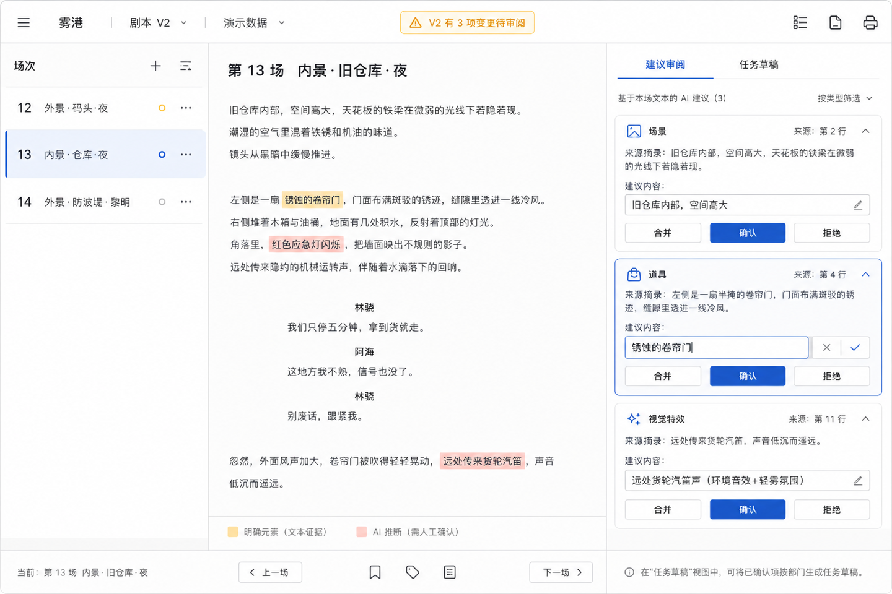
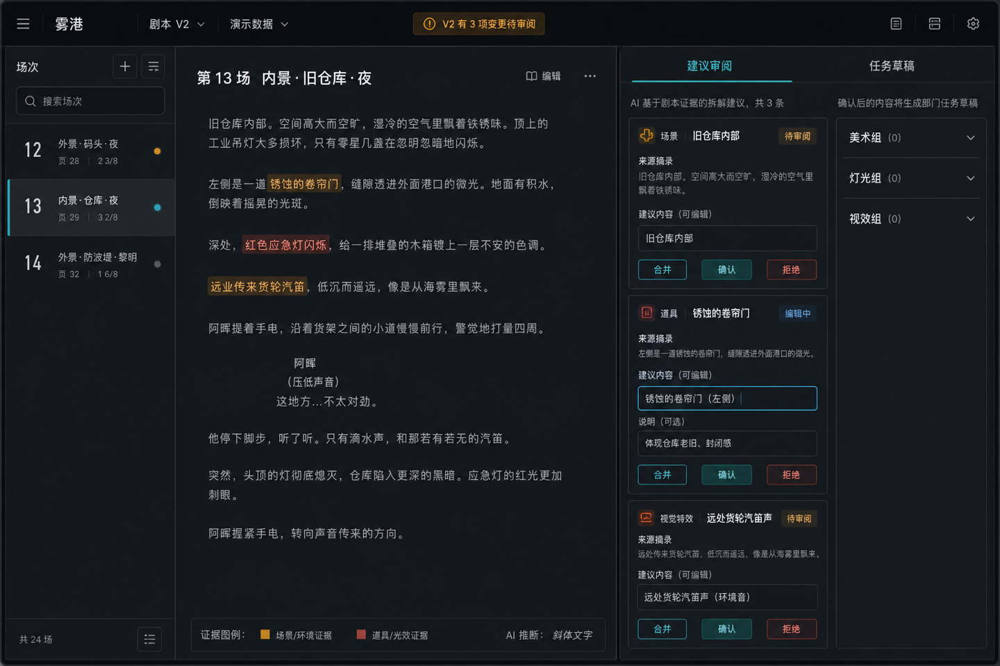
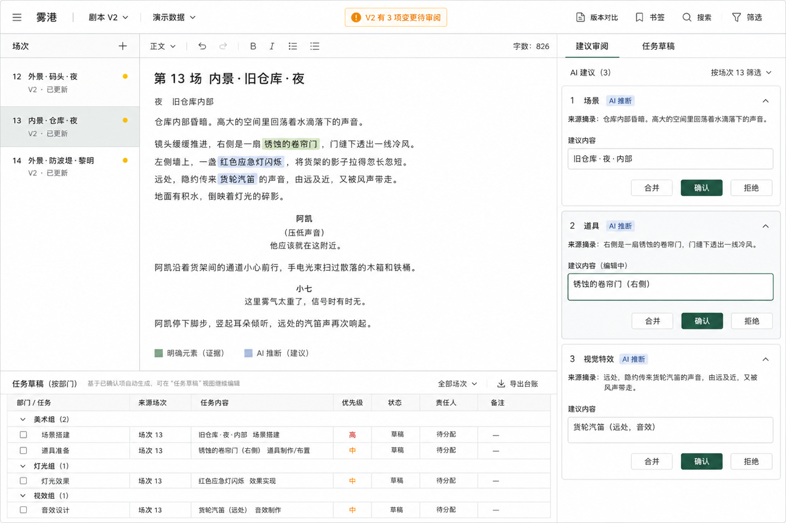

# 主屏视觉方向

本轮视觉探索固定同一套产品信息架构：顶部项目、剧本版本与运行模式；左侧场次；中间剧本文本及来源证据；右侧 AI 建议审阅；建议可编辑、合并、确认或拒绝；任务草稿按部门组织；V2 变更影响始终显式提示。三套方案均以 1440 × 960 桌面视口生成，目标是作为后续 React/Vite 实现的视觉规格，不代表已经完成交互实现。

## A：明亮精密的制片编辑器

方向 A 把“阅读剧本并逐条审阅建议”放在第一优先级。暖白底、细分隔线、低饱和蓝色操作与琥珀色影响提示，让场次、证据和建议之间的关系一眼可读。右栏中的编辑态和确认动作最清楚，适合面试演示时快速讲明核心审阅链。

取舍：这是三套里学习成本最低、实现风险最小的一套，但专业影视软件的独特气质相对弱；任务草稿只通过切换入口和说明露出，无法在单帧里完整证明部门台账结构。

可实现性：高。主体可直接用 CSS Grid 组织为三栏，场次列表、剧本文本、高亮标记、建议表单和 tabs 都是常规 React 组件。视觉主要依赖边框、浅色背景、基础表单控件与少量线性图标，不需要特殊图形能力。

## B：深色电影后期控制台

方向 B 用炭黑、深蓝灰与青蓝操作色建立后期制作环境的沉浸感。布局更接近专业剪辑软件的“素材导航—主查看器—检查器”，并在右侧同时露出部门分组，使建议确认后如何进入任务草稿更容易理解。

取舍：影视专业感最强，也最能形成记忆点；代价是长时间阅读的舒适度更依赖对比度控制，暗色表单的 hover、focus、disabled、错误和已确认状态需要更细致地设计。若处理不好，琥珀、红色与青色状态会相互竞争。

可实现性：高。结构仍是标准三栏 Grid，深色主题只增加 token 与状态样式工作量。无需实现时间线、播放器、波形或复杂特效；这些元素也不属于本产品主链。

## C：中性文档工作台与生产台账融合

方向 C 把产品的差异化价值直接放进同一帧：上半区完成场次、证据和建议审阅，下半区把已确认内容映射为按美术组、灯光组、视效组组织的任务草稿台账。纸白、雾灰与墨绿色强调务实、可审计和可交付，而不是通用 AI 聊天感。

取舍：信息闭环最完整，最适合证明“AI 建议不是终点”；代价是单屏密度最高。实现时必须保证中间剧本仍有足够阅读高度，并把下方台账作为可折叠或可调高度区域，否则较小桌面会同时损害阅读和任务管理。概念图中的文档格式工具只是视觉语汇，若不服务 Demo 主链，首版应删减为必要操作。

可实现性：高，但响应式与高度分配工作量略高于 A、B。可用外层三列 Grid，中列再做“剧本文本 + 可折叠任务台账”的纵向布局；任务区域使用语义化 table 或虚拟化之前的普通分组表格即可。首版不需要电子表格引擎。

## 推荐

推荐选择 **C：中性文档工作台与生产台账融合** 作为首选方向，并在实现时吸收 A 的右栏表单清晰度。

原因不是 C 展示的信息最多，而是它最直接对应当前产品结果：用户能看到证据如何成为人工可控的建议，以及确认后的内容如何进入部门生产任务。它因此比 A 更能证明完整产品闭环，也比 B 更适合公开 Demo 的长文本阅读与跨环境展示。

实现时建议保留三个纪律：默认仍以建议审阅为主任务；任务台账可折叠并设置最小/最大高度；V2 影响提示只表达待人工处理，不把版本变化自动写入既有任务。这样可以保留 C 的产品说服力，同时控制首版复杂度。

## 三套方案的共同实现边界

- 使用 React + Vite + TypeScript 的常规组件与 CSS Grid/Flex 即可，不引入画布渲染、复杂可视化或桌面壳层。
- 先建立少量视觉 token：页面/面板底色、正文/次要文字、分隔线、主操作、待审、拒绝、证据高亮、间距和小圆角。
- 将“建议审阅 / 任务草稿”建模为同一领域状态的两个视图，不复制两套数据；任务草稿由已确认建议派生并保留来源场次、版本和证据引用。
- V2 影响提示进入独立待审状态，不静默修改已确认实体或已生成任务。
- 首版不加入统计看板、聊天输入、协作头像、时间线、媒体播放器或与核心链无关的编辑器功能。
